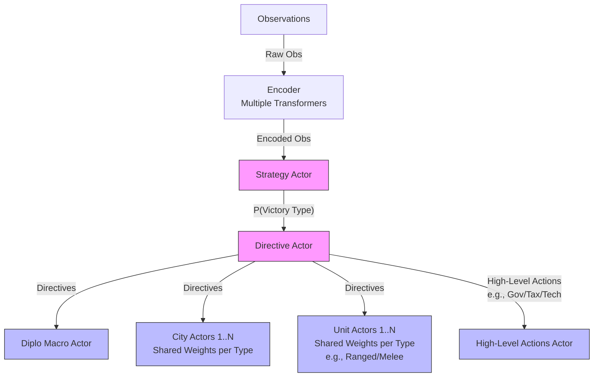

```mermaid
graph TD
    A[Observations] -->|"Raw Obs"| B[Encoder<br>Multiple Transformers]
    B -->|"Encoded Obs"| C[Strategy Actor]
    C -->|"P(Victory Type)"| D[Directive Actor]
    D -->|"Directives"| E[Diplo Macro Actor]
    D -->|"Directives"| F[City Actors 1..N<br>Shared Weights per Type]
    D -->|"Directives"| G[Unit Actors 1..N<br>Shared Weights per Type<br>e.g., Ranged/Melee]
    D -->|"High-Level Actions<br>e.g., Gov/Tax/Tech"| H[High-Level Actions Actor]
    style C fill:#f9f,stroke:#333
    style D fill:#f9f,stroke:#333
    style E fill:#bbf,stroke:#333
    style F fill:#bbf,stroke:#333
    style G fill:#bbf,stroke:#333
    style H fill:#bbf,stroke:#333
```

## Anticipated Difficulties
* coordination between distributed actors
* credit attribution 
* sparse/ long term rewards
